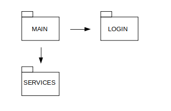
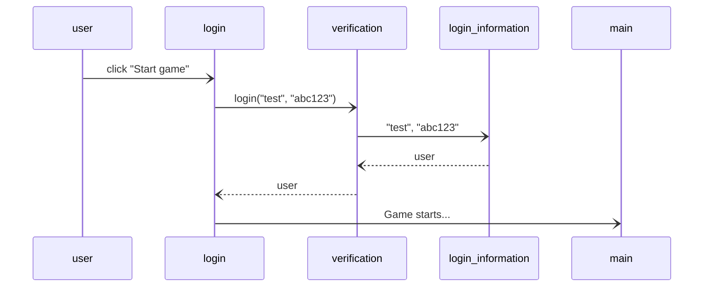

# Arkkitehtuurikuvaus

## Rakenne

Koodin pakkausrakenteen osat:
* main = Sisältää käyttöliittymän
* services = Sisältää sovelluslogiikan
* login = Sisältää kirjautumiseen liittyvän koodin

## Käyttöliittymä
Käyttöliittymässä on kolme erilaista näkymää: 
- Kirjautuminen
- Rekisteröityminen
- Pelin pelaaminen

Kun pelin käynnistää, ensiksi avautuu kirjautumisikkuna. Jos on aloittamassa peliä ensimmäistä kertaa, pitää painaa nappia "Register". Kirjautumisikkunan päälle avautuu rekisteröitymisikkuna. Rekisteröityä molemmat ikkunat häviävät ja pelin voi aloittaa. Seuraavalla kerralla, kun käyttäjätunnus on jo, riittää kirjautumisikkunanäkymä. Kun painaa "Start game", ikkuna häviää ja pelaamisen voi heti aloittaa.

## Sovelluslogiikka
Luokat:
* Player: Luo ja hallitsee pelattavaa hahmoa (pinkkiä neliötä). Pelaaja pystyy liikuttamaan.
* Platform: Luo ja hallitsee eri nopeuksilla liikkuvia erikokoisia laattoja, joille pelaajan on yritettävä osua hypyillään.

## Tietojen pysyväistallennus
- Kirjautuminen:
Luokka LogInView hallitsee kirjautumisikkunaa ja ottaa vastaan käyttäjän kirjoittamaa tietoa. Luokka kutsuu funktiota login(), joka tarkastaa onko käyttäjätunnukset tietokannassa.
- Rekisteröityminen:
Funktio register() hallitsee rekisteröitymisikkunaa ja ottaa vastaan käyttäjän tiedot. Funktio kutsuu toista funktiota, add_to_database(), joka tallentaa tiedot tietokantaan myöhempää kirjautumista varten.
### Tietokanta
Tiedon tallentamisessa hyödynnetään SQLiteä. Tiedot tallennetaan login_information.db tiedostoon.

## Päätoiminnallisuudet
Päätoiminnallisuuksien sovelluslogiikkaa sekvenssikaavioilla:
### Kirjautuminen sisään

