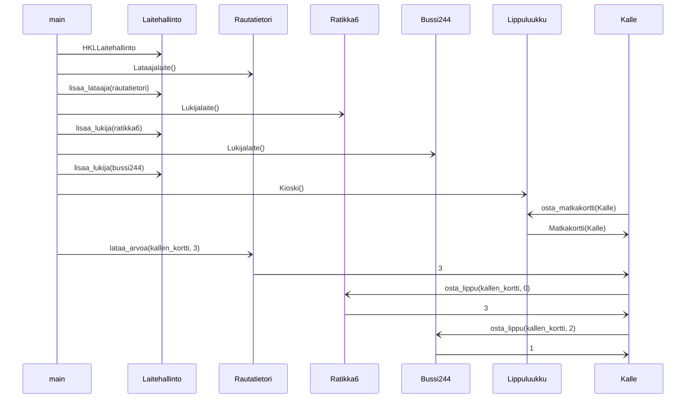

```mermaid
sequenceDiagram
  main-)Laitehallinto: HKLLaitehallinto
  main-)Rautatietori: Lataajalaite()
  main-)Laitehallinto: lisaa_lataaja(rautatietori)
  main-)Ratikka6: Lukijalaite()
  main-)Laitehallinto: lisaa_lukija(ratikka6)
  main-)Bussi244: Lukijalaite()
  main-)Laitehallinto: lisaa_lukija(bussi244)
  main-)Lippuluukku: Kioski()
  Kalle-)Lippuluukku: osta_matkakortti(Kalle)
  Lippuluukku-)Kalle: Matkakortti(Kalle)
  main-)Rautatietori: lataa_arvoa(kallen_kortti, 3)
  Rautatietori-)Kalle: 3
  Kalle-)Ratikka6: osta_lippu(kallen_kortti, 0)
  Ratikka6-)Kalle: 3
  Kalle-)Bussi244: osta_lippu(kallen_kortti, 2)
  Bussi244-)Kalle: 1
  
```
