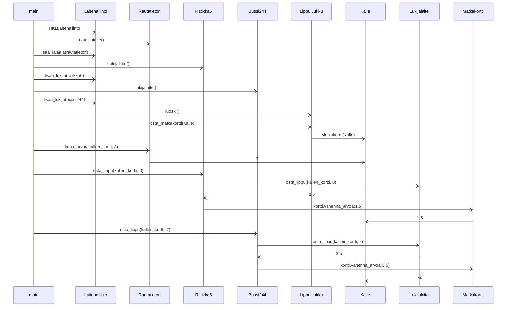

```mermaid
sequenceDiagram
  main-)Laitehallinto: HKLLaitehallinto
  main-)Rautatietori: Lataajalaite()
  main-)Laitehallinto: lisaa_lataaja(rautatietori)
  main-)Ratikka6: Lukijalaite()
  main-)Laitehallinto: lisaa_lukija(ratikka6)
  main-)Bussi244: Lukijalaite()
  main-)Laitehallinto: lisaa_lukija(bussi244)
  main-)Lippuluukku: Kioski()
  
  main-)Lippuluukku: osta_matkakortti(Kalle)
  Lippuluukku-)Kalle: Matkakortti(Kalle)
  main-)Rautatietori: lataa_arvoa(kallen_kortti, 3)
  Rautatietori-)Kalle: 3
  
  main-)Ratikka6: osta_lippu(kallen_kortti, 0)
  Ratikka6-)Lukijalaite: osta_lippu(kallen_kortti, 0)
  Lukijalaite-)Ratikka6: 1.5
  Ratikka6-)Matkakortti: kortti.vahenna_arvoa(1.5)
  Matkakortti-)Kalle: 1.5
  
  main-)Bussi244: osta_lippu(kallen_kortti, 2)
  Bussi244-)Lukijalaite: osta_lippu(kallen_kortti, 2)
  Lukijalaite-)Bussi244: 3.5
  Bussi244-)Matkakortti: kortti.vahenna_arvoa(3.5)
  Matkakortti-)Kalle: -2
  
  
  
```
