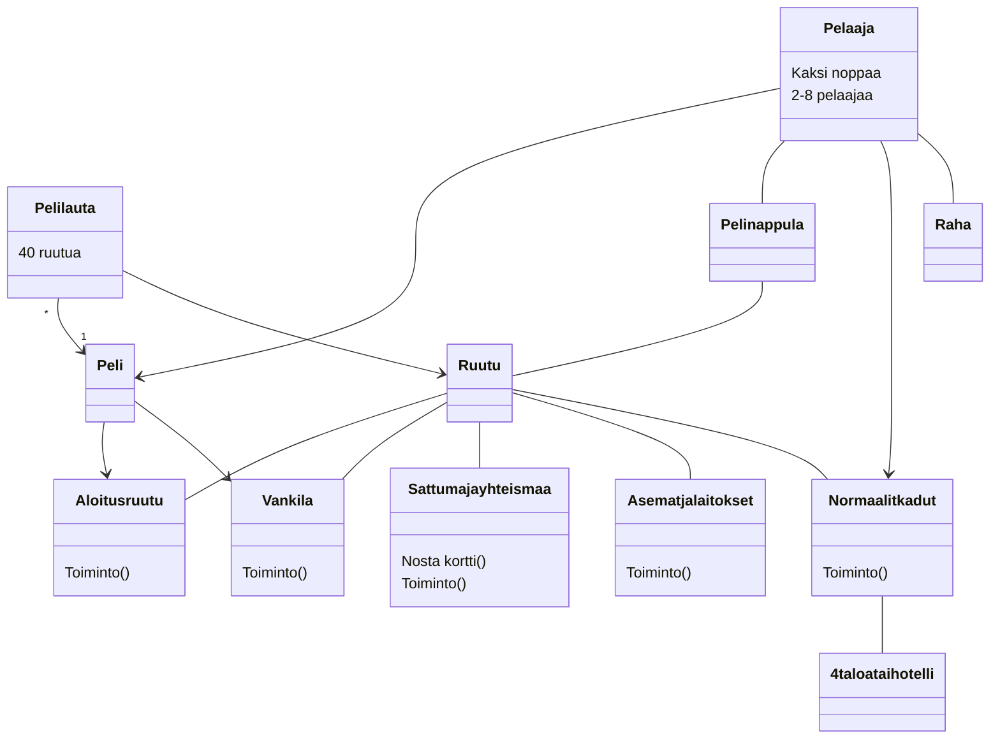

```mermaid
 classDiagram
      Pelilauta "*" --> "1" Peli
      Pelilauta : 40 ruutua
      Pelaaja --> Peli
      Pelaaja : Kaksi noppaa
      Pelaaja : 2-8 pelaajaa
      Pelaaja -- Pelinappula
      Pelinappula -- Ruutu
      Ruutu -- Aloitusruutu
      Ruutu -- Vankila
      Ruutu -- Sattuma ja yhteismaa
      Ruutu -- Asemat ja laitokset
      Ruutu -- Normaalit kadut
      Pelilauta --> Ruutu
      Pelaaja --> Normaalit kadut
      Normaalit kadut -- 4 taloa tai hotelli
      Normaalit kadut : Toiminto()
      Peli --> Aloitusruutu
      Peli --> Vankila
      Sattuma ja yhteismaa : Nosta kortti()
      Sattuma ja yhteismaa : Toiminto()
      Aloitusruutu : Toiminto()
      Vankila : Toiminto()
      Asemat ja laitokset : Toiminto()
      Pelaaja -- Raha
      
      
     
```
